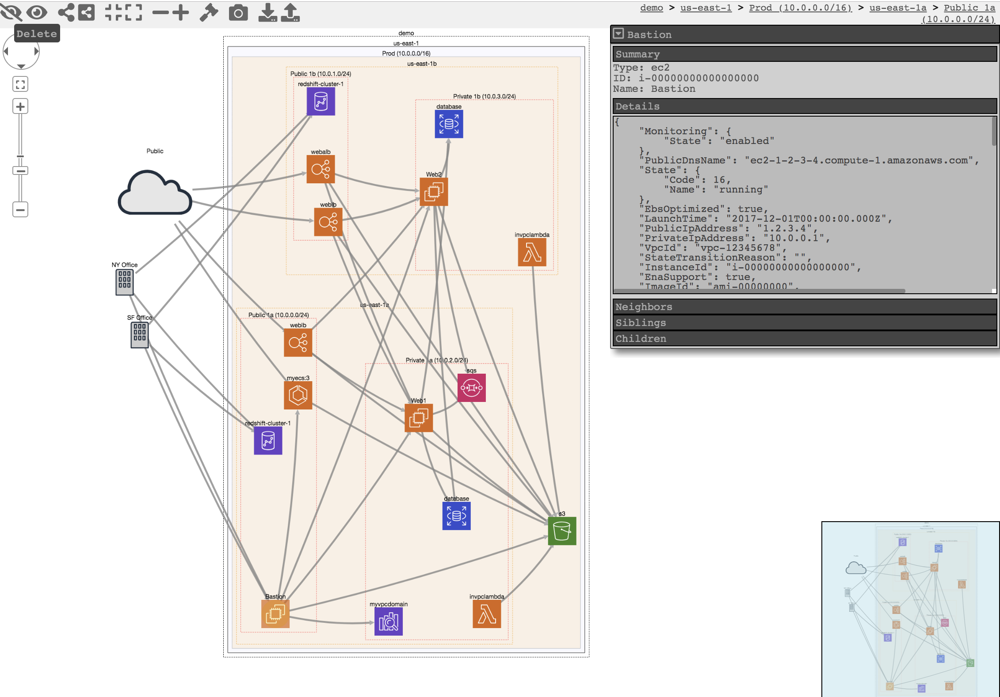

CloudMapper
========
CloudMapper helps you analyze your Amazon Web Services (AWS) environments.  The original purpose was to generate network diagrams and display them in your browser.  It now contains more functionality.

*Demo: https://duo-labs.github.io/cloudmapper/*

*Intro post: https://duo.com/blog/introducing-cloudmapper-an-aws-visualization-tool*

*Post to show usage in spotting misconfigurations: https://duo.com/blog/spotting-misconfigurations-with-cloudmapper*



## Installation

Requirements:
- `pip` and `virtualenv`
- You will also need `jq` (https://stedolan.github.io/jq/) and the library `pyjq` (https://github.com/doloopwhile/pyjq), which require some additional tools installed that will be shown.

On macOS:

```
# clone the repo
git clone git@github.com:duo-labs/cloudmapper.git
# Install pre-reqs for pyjq
brew install autoconf automake libtool jq
cd cloudmapper/
virtualenv venv
source venv/bin/activate
pip install -r requirements.txt
```

On Linux:
```
# clone the repo
git clone git@github.com:duo-labs/cloudmapper.git
# (Centos, Fedora, RedHat etc.):
# sudo yum install autoconf automake libtool python-devel jq
# (Debian, Ubuntu etc.):
# You may additionally need "build-essential"
sudo apt-get install autoconf automake libtool python-dev jq
cd cloudmapper/
virtualenv venv
source venv/bin/activate
pip install -r requirements.txt
```

With Docker (not well supported):
```
# Clone the repo
git clone git@github.com:duo-labs/cloudmapper.git
# Edit config.json
vi config.json
# Build the docker container
docker-compose build
# Set the accountname and run the container (assuming aws_* variables are set)
accountname="testaccount"  docker-compose up
```

## Run with demo data

A small set of demo data is provided.  This will display the same environment as the demo site https://duo-labs.github.io/cloudmapper/ 

```
python cloudmapper.py prepare --config config.json.demo --account demo
python cloudmapper.py webserver
```

This will run a local webserver at http://127.0.0.1:8000/

Alternatively using docker:
```
docker-compose build && accountname="demo" docker-compose up
```

# Setup

1. Configure information about your account.
2. Collect information about an AWS account.

## 1. Configure your account

### Option 1: Edit config file manually
Copy the `config.json.demo` to `config.json` and edit it to include your account ID and name (ex. "prod"), along with any external CIDR names. A CIDR is an IP range such as `1.2.3.4/32` which means only the IP `1.2.3.4`.

### Option 2: Generate config file
CloudMapper has commands to configure your account:

```
python cloudmapper.py configure {add-account|remove-account} --config-file CONFIG_FILE --name NAME --id ID [--default DEFAULT]
python cloudmapper.py configure {add-cidr|remove-cidr} --config-file CONFIG_FILE --cidr CIDR --name NAME
```

This will allow you to define the different AWS accounts you use in your environment and the known CIDR IPs.


## 2. Collect data about the account

This step uses the CLI to make `describe` and `list` calls and records the json in the folder specified by the account name under `account-data`.

You must have AWS credentials configured that can be used by the CLI with read permissions for the different metadata to collect.  This can be granted via the `SecurityAudit` policy, or can be reduced to an even more minimal set of permissions if desired for network visualization.  The minimal policy needed is:

```
{
  "Version": "2012-10-17",
  "Statement": [
    {
      "Effect": "Allow",
      "Resource": "*",
      "Action": [
        "ec2:DescribeRegions",
        "ec2:DescribeAvailabilityZones",
        "ec2:DescribeVpcs",
        "ec2:DescribeSubnets",
        "ec2:DescribeSecurityGroups",
        "ec2:DescribeVpcPeeringConnections",
        "ec2:DescribeInstances",
        "ec2:DescribeNetworkInterfaces",
        "rds:DescribeDBInstances",
        "elasticloadbalancing:DescribeLoadBalancers"
      ]
    }
  ]
}
```

Collecting the data can be performed with a bash script or via the python code base.  Both options support a `--profile-name` to specify the AWS account profile to use.

### Option 1: Bash script
Using the script is helpful if you need someone else to get this data for you without fiddling with setting up the python environment.

```
./collect_data.sh --account my_account
```

`my_account` is just a name for your account (ex. "prod").  You can also pass a `--profile` option if you have multiple AWS profiles configured.  You should now have a directory with .json files describing your account in a directory named after account name.

### Option 2: Python code

```
python cloudmapper.py collect --account-name my_account
```

# Commands

- `collect`: Collect metadata about an account. More details [here](https://summitroute.com/blog/2018/06/05/cloudmapper_collect/).
- `prepare`/`webserver`: See [Network Visualizations](docs/network_visualizations.md)
- `stats`: Show counts of resources for accounts. More details [here](https://summitroute.com/blog/2018/06/06/cloudmapper_stats/).
- `sg_ips`: Get geoip info on CIDRs trusted in Security Groups. More details [here](https://summitroute.com/blog/2018/06/12/cloudmapper_sg_ips/).

Licenses
--------
- cytoscape.js: MIT
  https://github.com/cytoscape/cytoscape.js/blob/master/LICENSE
- cytoscape.js-qtip: MIT
  https://github.com/cytoscape/cytoscape.js-qtip/blob/master/LICENSE
- cytoscape.js-grid-guide: MIT
  https://github.com/iVis-at-Bilkent/cytoscape.js-grid-guide
- cytoscape.js-panzoom: MIT
  https://github.com/cytoscape/cytoscape.js-panzoom/blob/master/LICENSE
- jquery: JS Foundation
  https://github.com/jquery/jquery/blob/master/LICENSE.txt
- jquery.qtip: MIT
  https://github.com/qTip2/qTip2/blob/master/LICENSE
- cytoscape-navigator: MIT
  https://github.com/cytoscape/cytoscape.js-navigator/blob/c249bd1551c8948613573b470b30a471def401c5/bower.json#L24
- cytoscape.js-autopan-on-drag: MIT
  https://github.com/iVis-at-Bilkent/cytoscape.js-autopan-on-drag
- font-awesome: MIT
  http://fontawesome.io/
- FileSave.js: MIT
  https://github.com/eligrey/FileSaver.js/blob/master/LICENSE.md
- circular-json: MIT
  https://github.com/WebReflection/circular-json/blob/master/LICENSE.txt
- rstacruz/nprogress: MIT
  https://github.com/rstacruz/nprogress/blob/master/License.md
- mousetrap: Apache
  https://github.com/ccampbell/mousetrap/blob/master/LICENSE
- akkordion MIT
  https://github.com/TrySound/akkordion/blob/master/LICENSE
